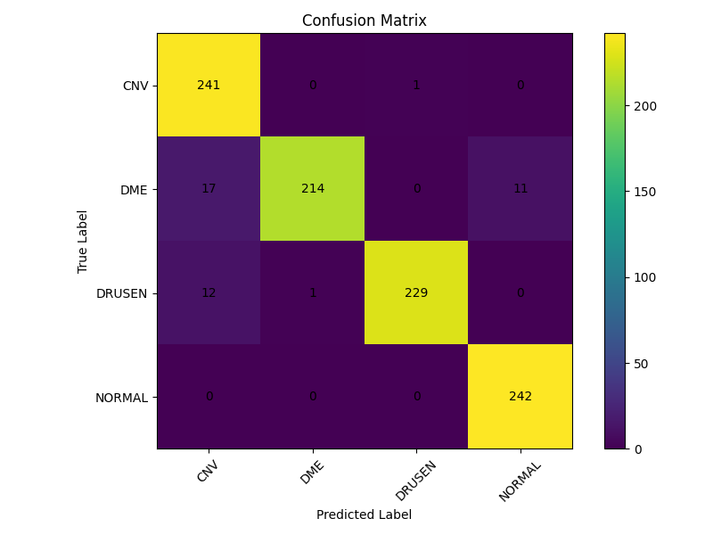

# OCT Scan Classification

A deep learning system built with PyTorch for automated classification of Optical Coherence Tomography (OCT) retinal scans using transfer learning on ResNet-18. Originally was a scratch CNN, stored on legacy branch. 


🔗 **[Live Demo](https://huggingface.co/spaces/Ludefulgentis/OCT-Image-Classification)** — Try it with your own OCT scans

## Diagnoses:
* Choroidal Neovascularization (CNV)  
* Diabetic Macular Edema (DME)   
* Lipid and Protein Deposits (DRUSEN)  
* Normal Retina (NORMAL)  

## Features
- ResNet-18 transfer learning with ImageNet pretrained weights
- Learning rate scheduling and automated checkpoint management
- Modular preprocessing and augmentation pipeline
- GPU-accelerated training with CUDA support
- Live inference application deployed on Hugging Face Spaces
- Automated testing via GitHub Actions CI/CD
- Confusion matrix and classification report generation

## Results

The ResNet-18 model achieved strong performance on the OCT2017 test dataset (84K images):

| Metric | Score |
|--------|-------|
| Test Accuracy | **97%** |
| Precision | 97% |
| Recall | 97% |
| F1-Score | 97% |

**Confusion Matrix:**



## Exploratory Data Analysis

Exploratory data analysis (EDA) was performed to inspect:

- Class balance
- OCT image dimensions
- Pixel intensity distributions
- Sample retinal scan visualization

Additional analysis and visualizations are included in the notebook/ directory.

## Example OCT Scans


## Dataset
Data Source: https://www.kaggle.com/datasets/paultimothymooney/kermany2018/discussion/372147

Dataset splits:
- Training: 83,484 images
- Validation: 32 images (8 per class)
- Test: 968 images (242 per class)

## Model Architecture

**Base:** ResNet-18 pretrained on ImageNet  
**Modifications:**
- Final fully connected layer: 512 → 4 classes
- Input: 224×224 RGB images
- Normalization: ImageNet statistics (mean=[0.485, 0.456, 0.406], std=[0.229, 0.224, 0.225])

**Training Configuration:**
- Optimizer: Adam (lr=0.001)
- Scheduler: StepLR (step_size=3, gamma=0.5)
- Epochs: 15
- Batch size: 32
- Data augmentation: Random horizontal flip, random rotation (±10°)

## Project Evolution

This project originally used a custom 2-layer CNN achieving 92% accuracy. The current implementation uses ResNet-18 transfer learning, improving performance to 97% test accuracy (5 percentage point improvement).

**Branches:**
- `main` — Current ResNet-18 implementation
- `legacy-cnn` — Original 2-layer CNN architecture (preserved for reference)

## Disease Descriptions
### Choroidal Neovascularization (CNV)
The abnormal growth of new blood vessels within the choroid. 

### Diabetic Macular Edema (DME)  
Diabetes symptom that causes swelling in the macula, the central part of the retina responsible for sharp, detailed vision.   

### Lipid and Protein Deposits (DRUSEN)
Small, yellow deposits that accumulate under the retina in the macula.

## Installation

Clone the repository:

```bash
git clone https://github.com/LuccaDeFulgentis/OCT-scan-classification
cd OCT_scan_classification
```

Create a virtual environment:

### Linux / macOS

```bash
python3 -m venv venv
source venv/bin/activate
```

### Windows PowerShell

```powershell
python -m venv venv
.\venv\Scripts\Activate.ps1
```

Install dependencies:

```bash
make install
```

---

## Running the Project

Train the model:

```bash
make train
```

Evaluate the saved model:

```bash
make evaluate
```

## CI/CD

Automated testing runs on every push via GitHub Actions:
- Model instantiation tests
- Forward pass shape validation
- Dependency installation checks

## Sources

- [PyTorch CIFAR10 Tutorial](https://docs.pytorch.org/tutorials/beginner/blitz/cifar10_tutorial.html)

- [GeeksforGeeks CNN Overview](https://www.geeksforgeeks.org/convolutional-neural-network-cnn-in-machine-learning/)

- [GeeksforGeeks ResNet Overview](https://www.geeksforgeeks.org/deep-learning/resnet18-from-scratch-using-pytorch/)

- [Hugging Face](https://huggingface.co/docs/transformers/en/model_doc/resnet)